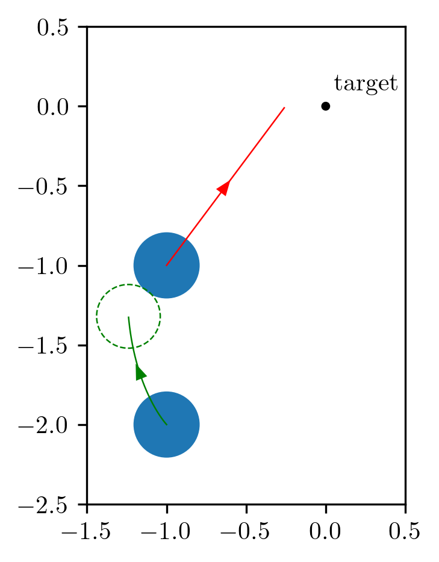
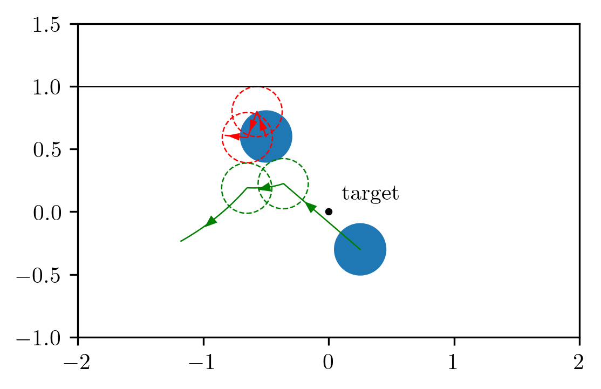
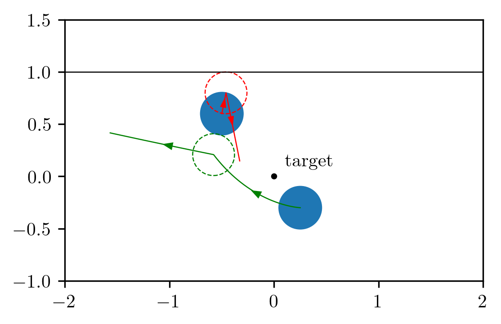
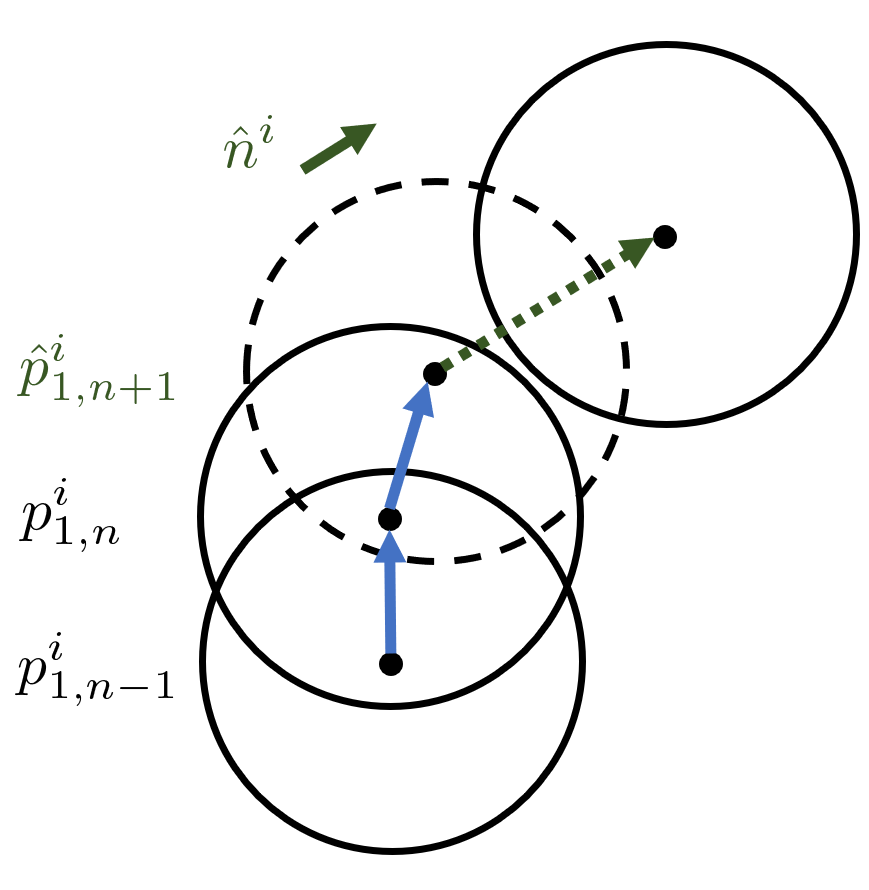
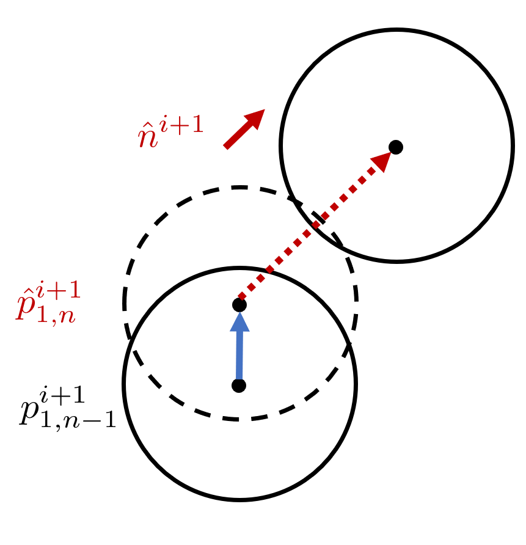
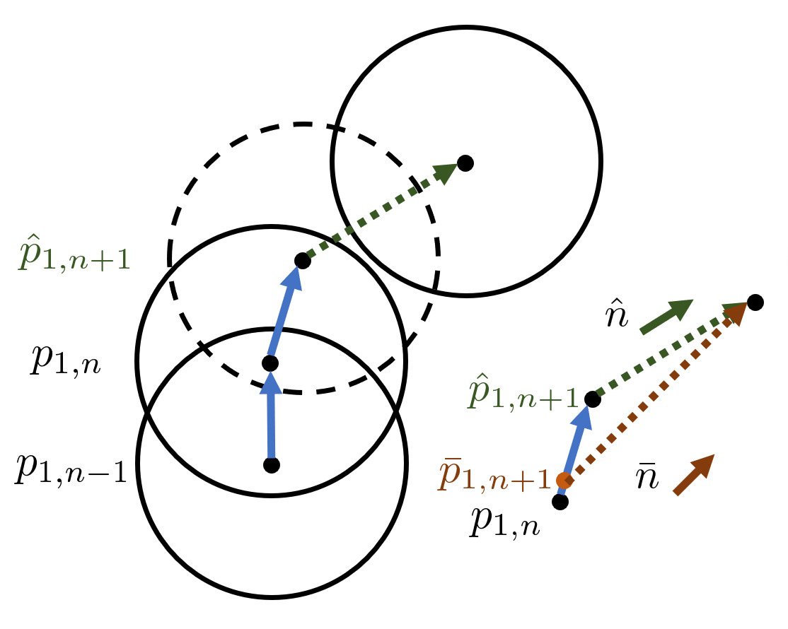

---

<div align="center">    
 
## Improving Gradient Computation for Differentiable Physics Simulation with Contacts

Yaofeng Desmond Zhong, Jiequn Han, Biswadip Dey, Georgia Olympia Brikis | 2023

[](https://arxiv.org/abs/2305.00092)
[](https://arxiv.org/abs/2305.00092)
[](https://arxiv.org/abs/2305.00092)


</div>

This repository contains Pytorch and Taichi implemenmtations to reproduce the optimal control tasks described in our [paper](https://arxiv.org/abs/2305.00092).

We have a [blog post](https://desmondzhong.com/blog/2023-improving-gradient-computation/) explaining this work with interactive plots! Feel free to check it out!


## Reproducibility

All experiments __do not__ require GPUs.

To install all dependencies:
```bash
pip install -r requirements.txt
# or to install the exact versions of packages as done in this work. 
pip install -r requirements_freeze.txt
```

To run the optimal control tasks
```
# single collision task, pytorch implementation
python single_collision/single_torch.py

# single collision task, taichi implementation
python single_collision/single_taichi.py

# multiple collisions task, pytorch implementation
python multiple_collisions/multiple_torch.py

# multiple collisions task, taichi implementation
python multiple_collisions/multiple_taichi.py
```

## Tasks

The goal of our optimal control tasks is to solve for the control sequence that minimize an objective. We can use differentiable simulation to calculate the gradients of the objective w.r.t. the control sequence and then use gradient descent to update control sequence iteratively. 

Here the optimized trajectory of the __single-collision__ task.

<p align="center">
 
</p>

Here are he trajectories before and after optimization of the __multiple-collision__ task. Notice that the number of collisions are different after optimization. 

| Before optimization  |   After optimization  | 
| :---------:|:------:|
|  |  |

## Method

We find that, due to time discretization, the post-collision velocities of objects are not changing smoothly over the optimization iterations, which results in wrong gradient calculation. This is indicated by the difference between red and green arrows (penetration directions) in figure (a) abd (b) below. We propose to use continuous collision detection (CCD) and leverage collision direction, indicated by the brown arrow in (c) below, to compute the post-collision velocity. We show that after applying our technique, the optimization is able to converge to the analytical optimal solution for the two tasks considered. Check out our [blog post](https://desmondzhong.com/blog/2023-improving-gradient-computation/) for a more detailed and intuitive explanation. 

| (a) iteration $i$  |   (b) iteration $i+1$  | (c) collision direction $\bar{n}$ | 
| :---------:|:------:|:------:|
|  |  |  |

## Citation
If you find this work helpful, please consider starring this repo and citing our paper using the following Bibtex.
```bibtex
@article{zhong2023improving,
  title={Improving Gradient Computation for Differentiable Physics Simulation with Contacts},
  author={Zhong, Yaofeng Desmond and Han, Jiequn and Dey, Biswadip and Brikis, Georgia Olympia},
  journal={arXiv preprint arXiv:2305.00092},
  year={2023}
}
```

